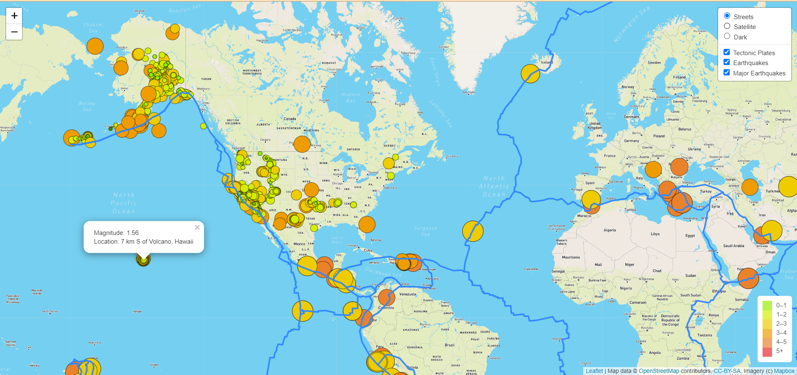
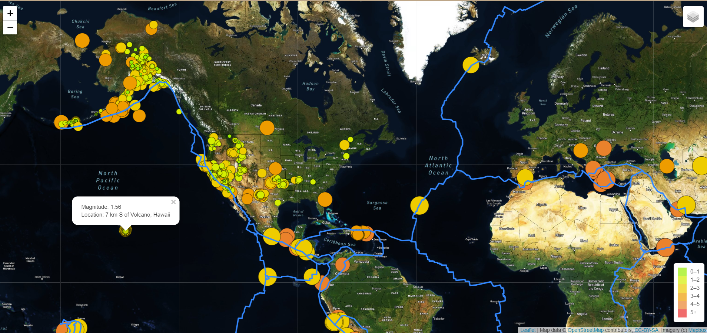
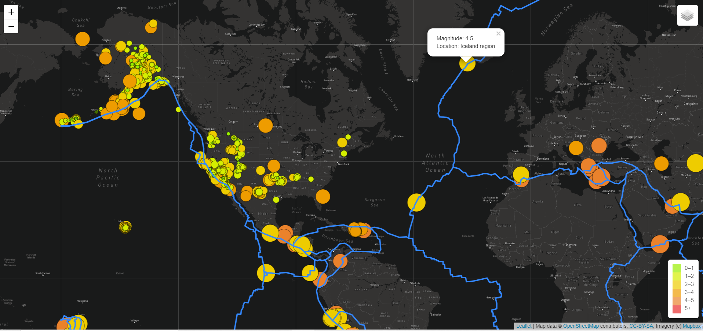

# Mapping Earthquakes

**Project overview**

The purpose of this project is to visually show the differences between the magnitudes of earthquakes all over the world. By be creating interactive maps using GeoJSON data.

**Resources**

Using a URL for GeoJSON earthquake data from the USGS website and retrieve geographical coordinates and the magnitudes of earthquakes JavaScript.

- D3.js library.
- Leaflet library.
- Mapbox

**Result**

